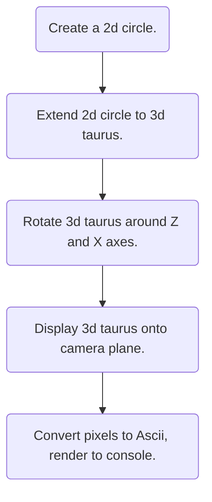

# Documentation behind the Donut C# Code.

This is a project based on the "Donut C" code by Andy Sloane, and the "Why a Spinning Donut is Pure Math" article by Marrten De Baecke.

## The mathematics behind it all.

To understand how this algorithm works and why it works it is important to understand the step by step process, and how mathematics achieves our desired goal.
The following diagram shows the step by step process over the algoritm.

### Diagram over the process

### The mathematics: Step by Step.

#### Rendering a 2D circle.

TODO:
